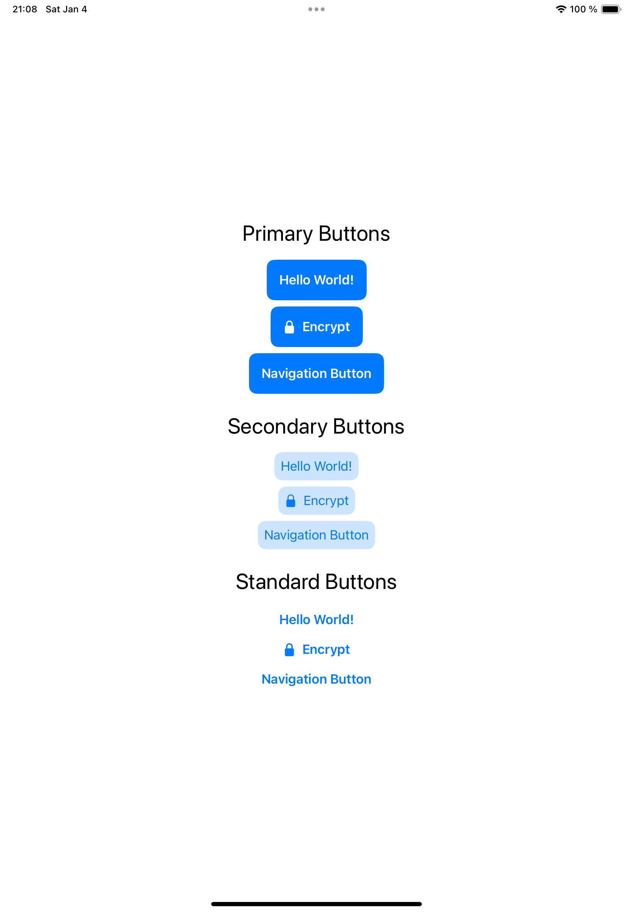

# CustomViewModifiersAndStyles

**CustomViewModifiersAndStyles** is a SwiftUI project that demonstrates the use of custom view modifiers and styles to enhance buttons and navigation buttons in a reusable way. The project provides two custom components and three button styles, along with two view modifiers integrated into the button styles.

## Features

### Components
1. **CustomButton**
   - A reusable button component that can adopt various styles.

2. **CustomNavigationButton**
   - A button designed for navigation use cases, styled consistently with the available button styles.

### Button Styles
1. **PrimaryButtonStyle**
   - Background: Uses the primary color.
   - Foreground: Default color.

2. **SecondaryButtonStyle**
   - Background: Primary color with a reduced alpha channel (semi-transparent).
   - Foreground: Primary color.

3. **StandardButtonStyle**
   - Background: None (transparent).
   - Foreground: Primary color (text-only style).

### View Modifiers
1. **HighlightEffectModifier**
   - Adds a hover effect for iPads with keyboards and Macs, enhancing user interaction.

2. **PressEffectModifier**
   - Adds a press effect to simulate a visual response when the button is tapped or clicked.

These view modifiers are integrated into the button styles to provide seamless interaction effects.

## Preview

Below is an example of the buttons and their styles in action:

